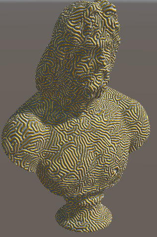
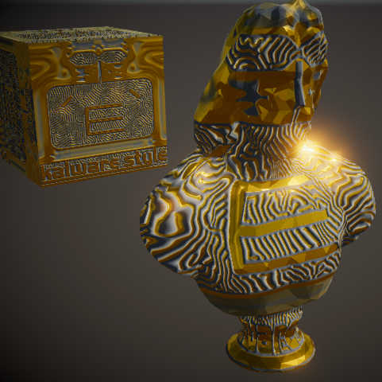

# Reaction Diffusion System for Unity

### System Requirements
- Unity 5.6f3

### Original 3D model
- "Colossal marble bust of Zeus" by The British Museum from Sketchfab  
https://sketchfab.com/models/9246efe1279543a784a08be62e6b96a8

### References
- Reaction-diffusion system  
https://en.wikipedia.org/wiki/Reaction%E2%80%93diffusion_system
- RDSystem by Keijiro Takahashi  
https://github.com/keijiro/RDSystem
